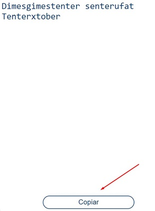
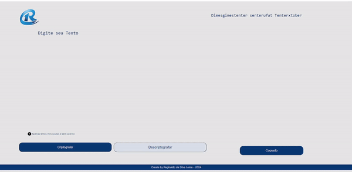

# CriptoApp Secreto 🤐

Bem-vindo ao CriptoApp Secreto! Esta aplicação foi desenvolvida para criptografar textos, permitindo que você troque mensagens secretas com pessoas que conheçam o segredo da criptografia utilizada.

## Tecnologias Utilizadas

-  **HTML**
-  **CSS**
-  **JavaScript**

## Funcionalidades Extras ✨

### Botão de Copiar

Você pode copiar facilmente o texto criptografado/descriptografado para a área de transferência clicando no botão correspondente. 📋

### Easter Egg Matrix

Clique no icone da imagem R para acionar o easter egg! Surpreendentemente, o layout da página se transformará em um tema MATRIX. 😎

## Como Usar

1. Insira o texto que deseja criptografar ou descriptografar na área designada.
2. Clique no botão correspondente para realizar a operação desejada.
3. Use o botão de copiar para compartilhar o texto de forma rápida.
4. Explore o easter egg Matrix para uma experiência única!

**Lembre-se de compartilhar o segredo da criptografia com seus amigos para trocar mensagens secretas!**

Divirta-se criptografando e descriptografando mensagens de forma segura! 🤫🔐
